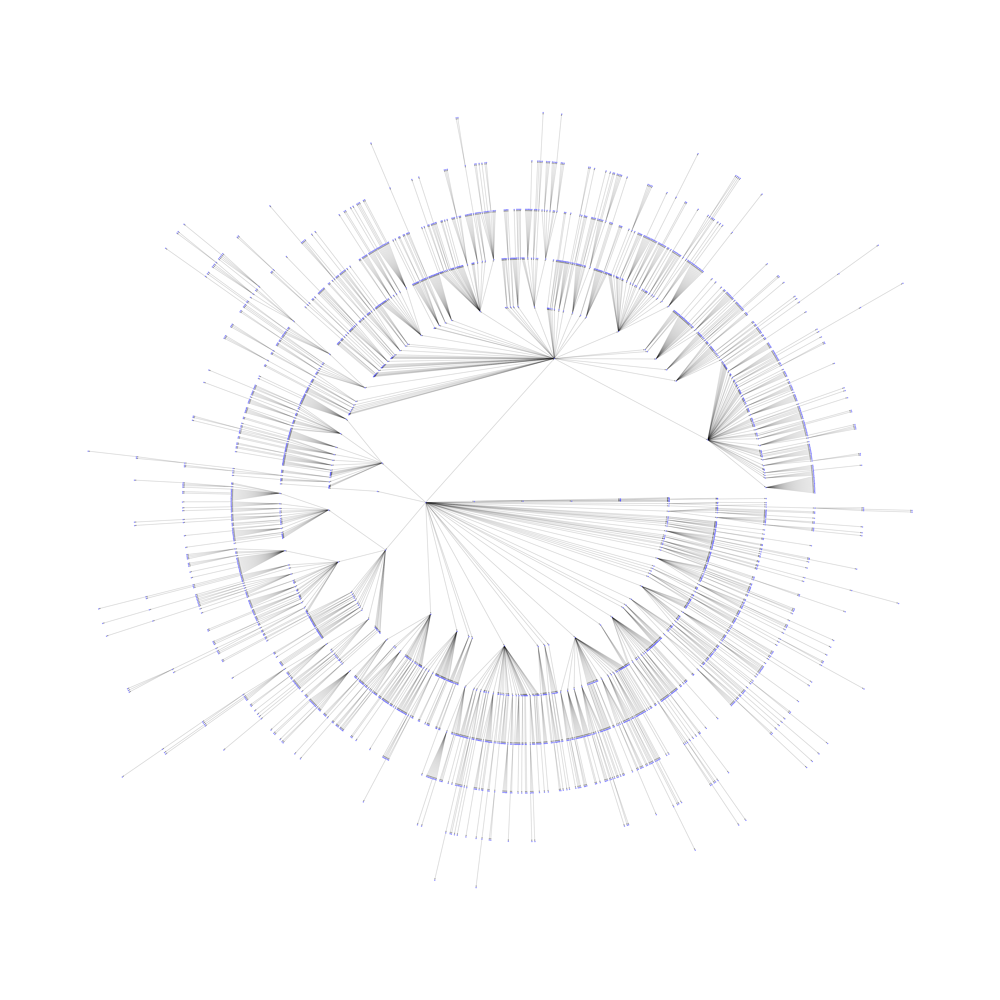

# Wordle solver
Simple implementation of a solver for Wordle, using the original wordlist.

This is not meant to be interactive. It just generates a solution tree by repeatedly partitioning the solution space. There's also a notebook that implements minimum solutions for Mastermind.

This project was used to explore the `cupy` library and Nvidia's new profiling tools over the course of a week, so don't expect too much from it =)

The figure below is the minimax tree partition of the wordle wordspace.

And this is what happens if you simply make the first valid guess every step while still tracking the resulting partitions perfectly.

As an introduction to the problem, these are excerpts from the Jupyter notebooks because the wordle one is too large for github to load through the browser.

## Abstract

Wordle is an imperfect information codeword completion game which is closely related to mastermind. This notebook is created to explore the implementation of an automated solver for wordle. I will assume familiarity with both games, and this notebook will refer to results and explanations in the mastermind notebook.

The main differences between Wordle and mastermind are:

1. The response message. In mastermind, the response message is a 2-tuple (n_exact_matches, n_color_matches) encoding how many, but not which, symbols are correct. In Wordle, the response does tell the codebreaker which of the symbols are correct, hence the response message in a wordle could be represented as a vector.
1. The initial codeword pool. In mastermind, the codeword pool is the space of all possible codewords. Where the number of symbols is $S$, and the codeword length is $L$, the initial pool size is $S^L$. For classic mastermind, also called MM(4,6) in the literature, $S=6$, $L=4$, and $S^L=1296$. In Wordle, although $S=26$ and $L=5$, the size of the initial pool is much smaller than $26^5\approx 1.188\times 10^7$ because we're limited to a small subset of valid words in English.

### Problem definition (for Mastermind)

In Mastermind, the goal of one player (guesser) is to deduce a hidden codeword. A Mastermind codeword (in the original version) is a sequence of 4 pins, and there are 6 possible colors for each pin. After each guess, the other player (setter) tells the guesser how many of those pins are correct (matched both position and color), and included (matched only color). The guesser needs to uncover the correct codeword in as few tries as he can.

The response to a guess is encoded by a number of black and white pins. A black pin indicates an exact match, of both position and color. A white pin indicates correct color only, while no pin indicates neither, i.e. both color and position didn't match. Note that neither black/white pins nor hole indicates *which* symbol(s) in the guess are correct (or not). Hence all possible responses could be encoded as a 2-tuple `(n_match_exact, n_match_color)`. The correct guess in the original Mastermind would elicit the response (4,0).

There are numerous optimal strategies with different optimality criteria, as could be seen in (Dowell). Perhaps the most well-known is Knuth's solution in 1976 (Knuth 1976), where he showed that his algorithm solves any codeword in the original mastermind with an upper bound of 5 steps. However, Knuth did not explain how he arrived at his partitioning of the problem space into the tree used by his algorithm, nor how he had chosen his initial guess of 1122.

To set up the problem, we have a small set of symbols (the pins), which make up the codeword. The set of all possible codewords is called the vocabulary. Since the set of symbols is countable, we can encode all the symbols by enumeration. And since all codewords are of length 4, the set of all codewords is 4-way cross product that produces a vocabulary size of $6^4=1296$:

Let $\mathcal{S}=\{1,2,3,4,5,6\}$

Let $\mathcal{V}=\mathcal{S}\times\mathcal{S}\times\mathcal{S}\times\mathcal{S}$

At any time, the guesser's goal is to minimize the number of guesses to deduce the hidden codeword. This means to reduce the remaining possibilities - called the solution or code pool - to 1. However, at face value, it's difficult to tell if a greedy strategy, i.e. minimizing the solution pool in the current step, is necessarily a globally optimal strategy, even without strictly defining what "optimality" means. Usually greedy algorithms aren't globally optimal. In fact, playing greedy (single step lookahead) isn't globally optimal for Mastermind, as mentioned in (Bestavros 1986).

We'll follow the notation in (Bestavros 1986). Let $P_i$ denote the solution pool at the $i$th time step. From the initial solution pool $P_0=\mathcal{V}$, after the $i$th guess, the solution pool reduces to $P_{i}\subset P_{i-1}$.

Let $\{G^1_i, G^2_i, ..., G^k_i\}=P_{i-1}$ denote the set of possible guesses in the $i$th time step. If guess $G^k_i$ is made in the $i$th time step, the new solution pool $P_i$ consists of all members in $P_{i-1}$ which are still possible, based on the $i$th response from the setter. When $\#P_i=1$ for some $i$, the game is won.

Likewise, let $\{R^1_i, R^2_i, ..., R^n_i\}$ be the set of all possible responses from the setter in the $i$th time step. Let $R^j_i$ be the setter's response in the $i$th time step.

### Information and the message tuple

In (Bestavros 1986), the authors quantified information content in an interesting way, in section 1.3 of their paper. We'll follow their reasoning and work our way to implementing MaxMin, which is very similar in terms of implementation (basically the opposite) to Knuth's algorithm, which uses MiniMax. Intuitively, we want to maximize the information gained (by some measure), from every guess that we make. Disambiguation: In Bestavros et al's original paper, the glyph $R$ is also used to denote the upper bound for the number of symbols. It won't have that meaning here.

After the $i$th round of the game, the tuple $(P_{i-1}, G^k_i, R^j_i)$ may be viewed as a message $m_i$ from some information source $\Omega$. The information in the message $I(m_i)$ can be used to get a new pool $P_i$ from $P_{i-1}$. Intuitively, the greater $I(m_i)$ is, the smaller the size of the new pool should be.

Aside: In order for information content to mean anything at all, we need to know the probability of each message. Usually, that means constructing the set of all possible messages $m_i$, and that would be $P_{i-1}\times G^k_i \times R^j_i$, and then observing or assuming some prior probability distribution the messages are distributed over.

However, going through the elements of the 3-tuple, $P_{i-1}$ was already computed in the $i-1$th time step, so there's only one such possible pool in the current time step. There's also only one guess $G^k_i$ made in the current time step. This means the number of possible messages $m_i$ is just the number of possible responses $\{R^1_i, R^2_i, ..., R^j_i\}$ from the setter in the current time step.

By the nature of the game, a guess $G^k_i$ imposes a partition on the remaining pool of codewords $P_{i-1}$. These partitions correspond to all possible responses $R^j_i$ in reponse to that one guess.

Aside: Initially, I found it difficult to see why this is a set partition (mutually disjoint sets). It's easier to see from the bottom up. Starting from any pool of solutions, for any guess, the most important observation to make is that there is only one legal response for any pattern. Therein lies the set partition.

Define $c^k_i(R^j_i)=c(P_{i-1}, G^k_i, R^j_i)$ as a notation aid in writing down this set partition. The original paper abuses notation by declaring only the shorthand $c^k_i(R^j_i)$. This is because $P_{i-1}$ is fixed and we only need to track the index $k$ of the guess $G^k_i$.

$$
\begin{align}
P_{i-1} &= c(P_{i-1},  G^k_i, R^1_i) \ \bigcup c(P_{i-1}, G^k_i, R^2_i) \ \bigcup \ ... \ \bigcup c(P_{i-1}, G^k_i, R^j_i) \\
&= c^k_i(R^1_i) \ \bigcup c^k_i(R^2_i) \ \bigcup \ ... \ \bigcup c^k_i(R^j_i)
\end{align}
$$

and just so that it's clear that $c$ are partitions of $P_{i-1}$,

$$
c^k_i(R^a_i) \bigcap c^k_i(R^b_i) = \emptyset \ ; \ \forall \ 0 \lt a,b \leq j \ ; \ a \neq b
$$

Now we have enough material to ask the question: What is the probability of getting a particular message $m_i$? Well, since we have a 1-1 mapping between messages and responses, it's the probability of getting the response $R^j_i$. Since $c^k_i$ partitions $P_{i-1}$, by the law of total probability, that's simply:

$$
Prob[m_i]=\frac{Prob[c^k_i(R^j_i)]}{Prob[P_{i-1}]}
$$

How do we evaluate that? Well, we know that the set of patterns $P_i$ for any $i$ is countable and finite. If we assume a uniform distribution over each pattern in the initial pool $P_0$, we could compute the above expression by counting, if the total number of patterns is "small enough". By using this prior, we are assuming the setter is picking patterns completely at random. Thus the probability is:

$$
Prob[m_i]=\frac{\# c^k_i(R^j_i)}{\# P_{i-1}}
$$

And thus the information of a message is:

$$
I(m_i) = -\log Prob(m_i) = \log \# P_{i-1} - \log \# c^k_i(R^j_i)
$$

Finally, the total information in $P_0$ is $\log 6^4$. The game ends after $n$ rounds, when our total information equals this value:

$$
\sum^n_{i=1}\log I(m_i) = \log 6^4
$$